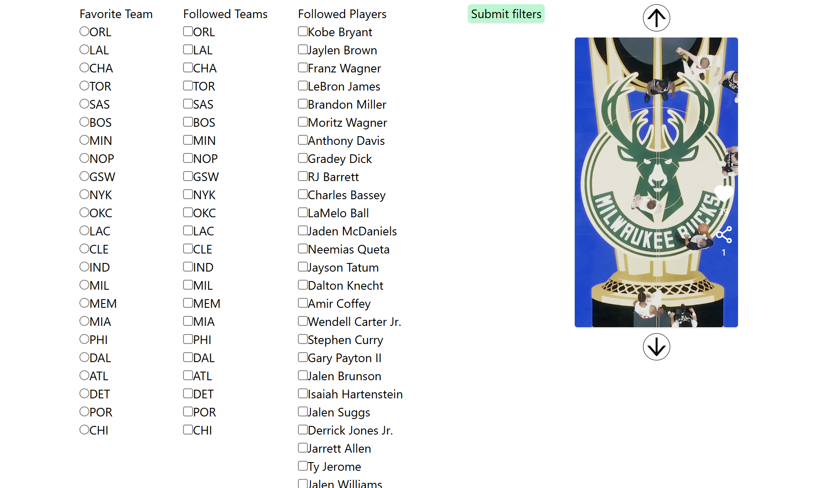

This is an imitation of a TikTok-like front-end. It presents the videos returned by the API in a similar way, with the user being able to go to the next video by pressing on the up/down arrows instead of scrolling. The user can also pause and play the video at any time by clicking on it.

Additionally, there is a form that takes team and player names from the first API response when the page first renders. The data given to these forms is used to create the query parameters "userAttributes[favoriteTeam/followedTeams/followedPlayers]" when the button is submitted, and are all appended to the original API endpoint. The clip feed will re-render with the videos from the new modified API response.

The project uses React, TypeScript and Vite, with "react-icons" as a dependency, in particular the Ant Design Icons (https://react-icons.github.io/react-icons/icons/ai/). For styling, I chose to use Tailwind CSS. To run it, please run `npm run dev` in a terminal. `npm install` might be necessary in case of missing dependencies.

